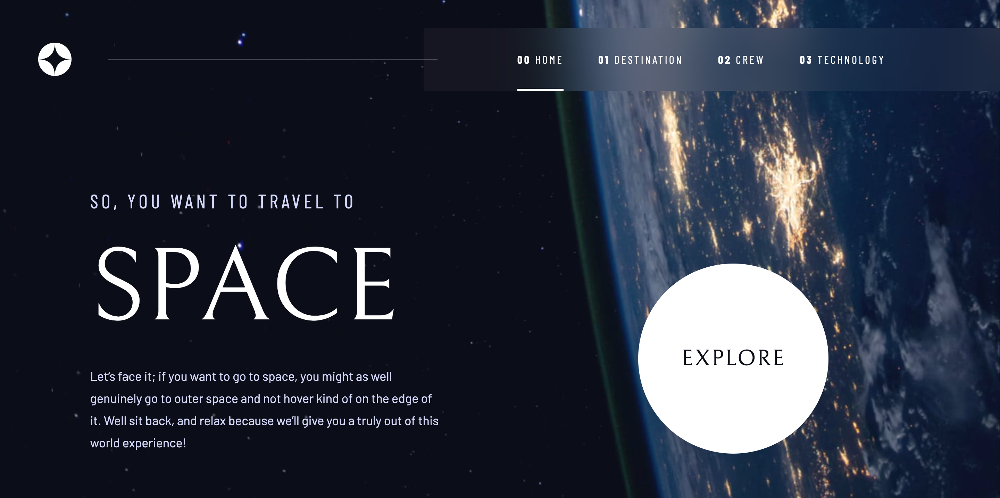
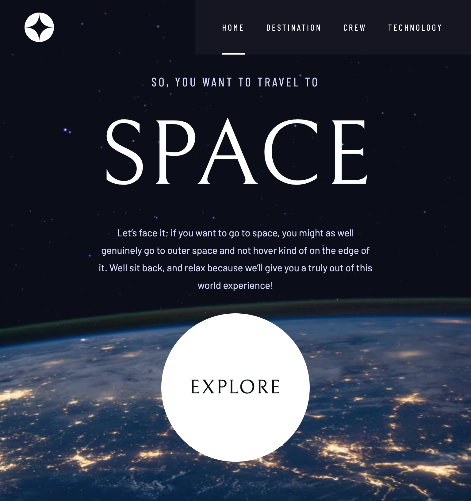
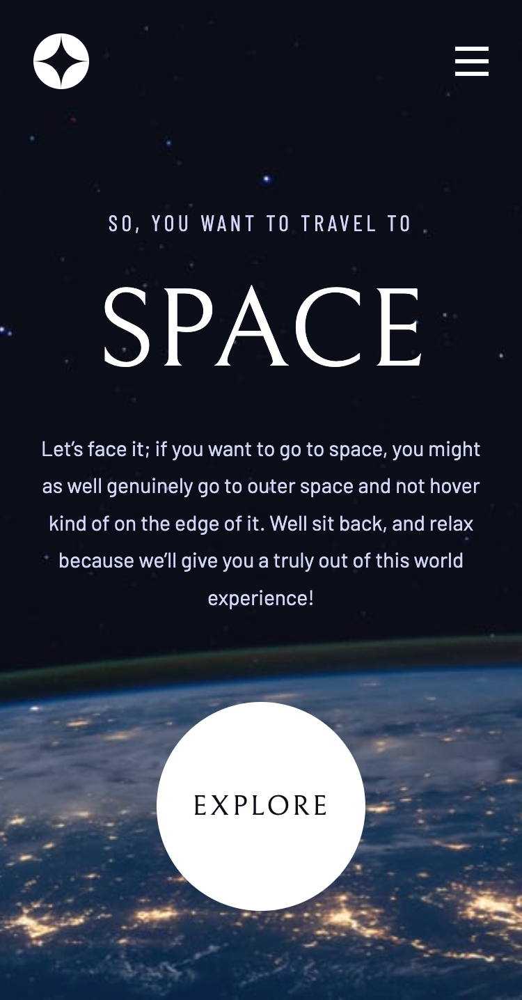

# Frontend Mentor - Space tourism website solution

This is a solution to the [Space tourism website challenge on Frontend Mentor](https://www.frontendmentor.io/challenges/space-tourism-multipage-website-gRWj1URZ3). Frontend Mentor challenges help you improve your coding skills by building realistic projects.

## Table of contents

- [Overview](#overview)
  - [The challenge](#the-challenge)
  - [Screenshot](#screenshot)
  - [Links](#links)
- [My process](#my-process)
  - [Built with](#built-with)
  - [What I learned](#what-i-learned)
  - [Continued development](#continued-development)
  - [Useful resources](#useful-resources)
- [Author](#author)
- [Acknowledgments](#acknowledgments)

## Overview

### The challenge

Users should be able to:

- View the optimal layout for each of the website's pages depending on their device's screen size
- See hover states for all interactive elements on the page
- View each page and be able to toggle between the tabs to see new information

### Screenshot

<p>Desktop version</p>

<p>Tablet version</p>

<p>Mobile version</p>


### Links

- Solution URL: [https://www.frontendmentor.io/solutions/responsive-space-tourism-website-using-nextjs-13app-router-bbo-mdrB-v](https://www.frontendmentor.io/solutions/responsive-space-tourism-website-using-nextjs-13app-router-bbo-mdrB-v)
- Live Site URL: [https://fm-space-tourism-website-kennylun123.vercel.app/](https://fm-space-tourism-website-kennylun123.vercel.app/)

## My process

### Built with

- Semantic HTML5 markup
- CSS custom properties
- Flexbox
- CSS Grid
- [React](https://reactjs.org/) - JS library
- [NextJS (App Router)](https://nextjs.org/) - React framework
- CSS Modules
- CUBE CSS

### What I learned

- Defining routes, setting up pages and layouts with NextJS (App Router)

- The relationship of server side rendering(SSR) and client side rendering. Basically means that the components which need user interaction shall be render in client side. In opposite, the components without interaction should stay in server side for pre-rendering in build time.

- Setting up a universal grid layout, first to consider how many column in the page, how many space should be taken by main content, then how the grid lines should be composed.

./page.js

```html
<div className="{`grid" gridContainer ${styles.containerHome}`}>...</div>
```

./page.module.css

```css
.containerHome {
  align-items: end;
}
```

./global.css

```css
.grid {
  display: grid;
  gap: var(--grid-gap, 1rem);
}

.gridContainer {
  padding-left: 1rem;
  padding-right: 1rem;
  padding-bottom: 4rem;
  grid-template-columns:
    minmax(1rem, 1fr)
    repeat(2, minmax(0, 40rem))
    minmax(1rem, 1fr);
  column-gap: 2rem;
  place-items: center;
}
```

- CSS function: clamp(), clamps a middle value within a range of values between a defined minimum bound and a maximum bound.

```css
:root {
  --fs-900: clamp(5rem, 10vw + 1rem, 9.375rem);
}
```

- CSS function: minmax(), defines a size range greater than or equal to min and less than or equal to max. It is used with CSS Grids.

### Useful resources

- [Defining Routes on NextJS](https://nextjs.org/docs/app/building-your-application/routing/defining-routes)

- [Server Components](https://nextjs.org/docs/app/building-your-application/rendering/server-components)

## Author

- Frontend Mentor - [@kennylun123](https://www.frontendmentor.io/profile/kennylun123)
- Twitter - [@kenny_ng123](https://twitter.com/kenny_ng123)
